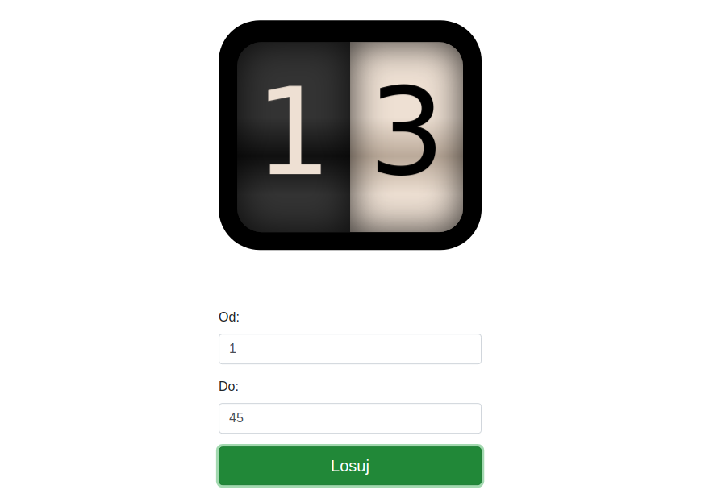

# random-app-generator
Losowanie liczb

Aplikacje zbudowane na podstawie biblioteki `odometer`, `boostrap` i `jquery`

## Aplikacja do losowania jednej liczby

- https://github.hubspot.com/odometer

## Aplikacja do losowania więcej niż jednej liczby

- https://github.com/wqzwh/odometer - umożliwia ustawienie zer wiodących - np. 023

